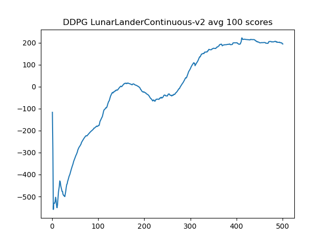
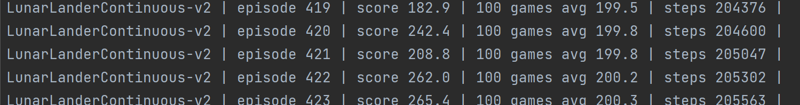
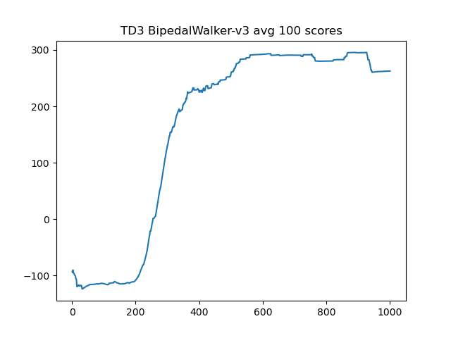
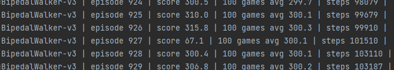

# [OpenAI GYM](https://gym.openai.com/) Reinforcement learning implementations

Implementations of various Deep Reinforcement learning algorithms,
tested on environments provided by OpenAI

## [Leaderboard](https://github.com/openai/gym/wiki/Leaderboard)

### LunarLanderContinuous , **5th place**

---
### BipedalWalker-v3 , **2nd place**

